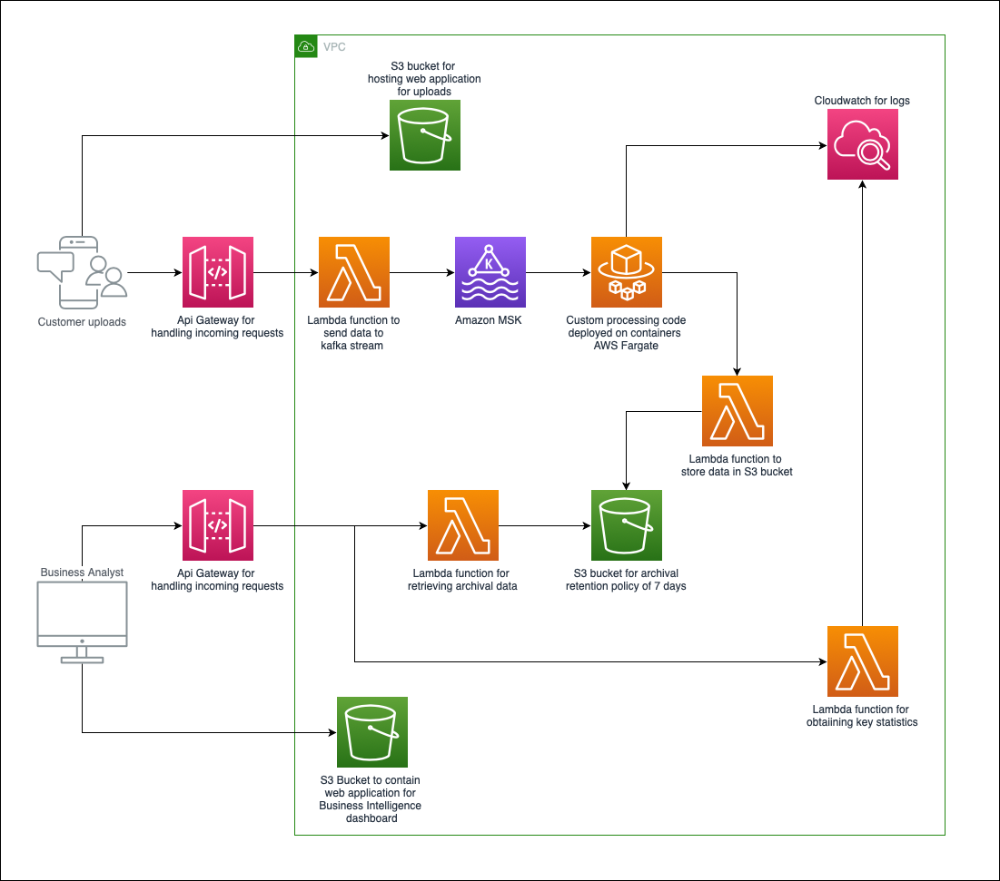

# Section 3 Design Explanation

## Overview

Use of managed service by AWS for kafka queue.  
Use of static web applications stored inside S3 buckets which are rendered client-side.  
Main communication of data through http requests.  
Application protected by API gateways to handle incoming requests.  
S3 bucket used for archival purposes with retention policy of 7 days before deletion.

## Assumptions
Web application would not need to be server-side rendered.  
Auto-balancing and scaling handled by AWS Fargate.  

## System Design

